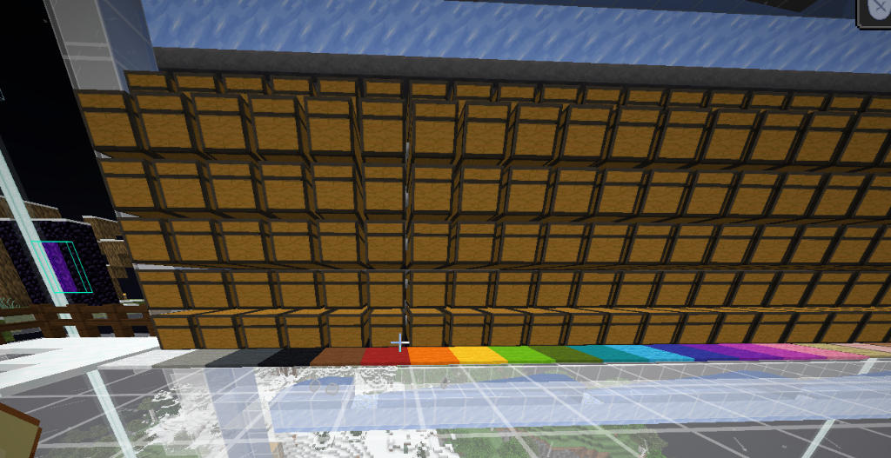
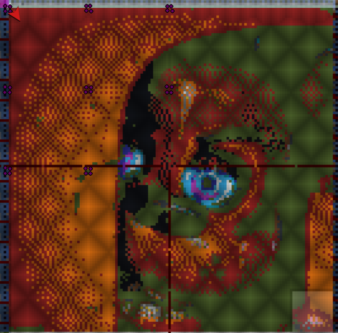
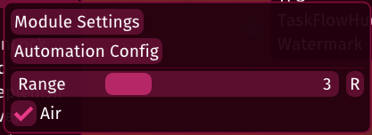
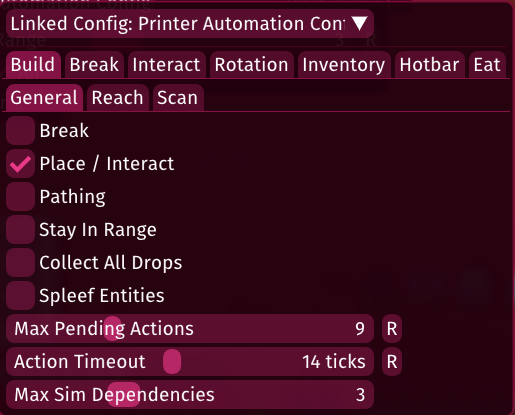
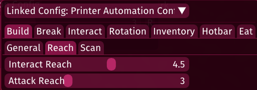

# 🗺️ MapArt Assistant

A fully automated, client-side Fabric mod designed to build massive MapArts in Minecraft with zero manual effort. It integrates seamlessly with **Litematica** to read schematics and uses **Baritone** to handle pathfinding and block placement.

---

## 🎉 Community & Resources

**Shoutout to the Mapartists of 2b2t!**
If you're building on the oldest anarchy server in Minecraft, come join the official Mapartists of 2b2t Discord community here: [https://discord.com/invite/r7Tuerq](https://discord.com/invite/r7Tuerq)

**Recommended MapArt Platform Schematic:**
Need a flat, solid foundation to build your art on? You can download my recommended platform schematic here: [Download Schematic](https://discordapp.com/channels/349201680023289867/1418153264351805553)

---

## ✨ Features
* **Fully Automated Building**: Reads your Litematica schematic and places blocks automatically.
* **Smart Chest Assignment**: Tell the bot which chests contain which blocks, and it will fetch them automatically when it runs out!
* **Auto-Cleanup**: Drops unnecessary blocks when transitioning between different parts of the build.
* **Baritone Integration**: Advanced pathfinding ensures the bot never gets stuck and can navigate complex terrain.

---

## 📜 Commands

The mod uses a # prefix by default (configurable in the mod settings).

| Command | Description |
|---|---|
| #start | Starts the MapArt building process from the beginning. |
| #stop | Completely stops the bot, halts Baritone, and resets its state. |
| #pause | Pauses the bot in its current place (useful if you need to intervene). |
| #resume | Resumes the bot from where it was paused. |
| #clean | Scans the area and cleans up any accidentally misplaced carpets or blocks. |
| #setchest <block_id> | Assigns the chest you are currently looking at to the specified block (e.g., #setchest minecraft:white_carpet). |
| #clearchests | Clears all of your saved chest assignments. |

---

## ⌨️ Default Keybinds

Instead of typing commands, you can use the default hotkeys to quickly control the bot:

| Key | Action |
|---|---|
| **O** | Open the MapArt Settings & Config Menu |
| **P** | Start / Stop the Bot |
| **[** *(Left Bracket)* | Pause / Resume the Bot |

---

## 📦 How the Chest Assignment System Works

For large MapArts, you can't fit all the required blocks in your inventory. The **Chest Assignment System** solves this by letting the bot restock itself!

**How to use it:**
1. Place a chest and fill it with the block you need (e.g., White Carpet). *Tip: You can stack them in giant columns like the image above!*
2. Look directly at the bottom chest.
3. Type #setchest minecraft:white_carpet. 
4. Repeat this for all the different blocks your MapArt requires.

**What the bot does:**
When the bot is building and runs out of White Carpet, it will instantly stop, pathfind back to the exact chest you assigned, grab as much White Carpet as it can hold, and then walk right back to where it left off to continue building. If a chest gets full or empty, it dynamically adjusts and looks for the next chest in the column!

---

## 🔍 How the Bot Searches & Builds

1. **Schematic Scanning**: The bot hooks directly into Litematica to scan the loaded schematic within the boundaries you set in the mod options.
2. **Color by Color**: As seen above, it sweeps across the canvas placing blocks color by color to minimize switching inventory slots.
3. **Inventory Matching**: It actively compares the blocks required by the schematic against the blocks currently in its inventory. 
4. **Pathfinding execution**: Once it determines the next block it needs to place, it calculates the most efficient route and commands Baritone to walk there and execute the placement.

---

## ⚙️ Dependencies

To use this mod, you will need the following installed:
* [Fabric Loader](https://fabricmc.net/)
* [Fabric API](https://modrinth.com/mod/fabric-api)
* [Litematica](https://www.curseforge.com/minecraft/mc-mods/litematica)
* [Baritone](https://github.com/cabaletta/baritone)
* [Lambda Client](https://github.com/lambda-client/lambda) (Highly recommended for the Printer module)

---

## 🖨️ Recommended Lambda Printer Settings

To actually place the blocks, this mod relies on a client-side Printer. We highly recommend using the **Lambda Client**. While you can absolutely choose to use a different printer, you will likely need to tweak its settings to get it working smoothly. 

Below are the exact Lambda Printer settings that work flawlessly for me. *(Note: These are just the settings that work best for my connection and playstyle. Other settings might work better for other players or for different servers depending on your ping/TPS!)*

**Module Settings > Automation Config**

**Build > General**

**Build > Reach**

